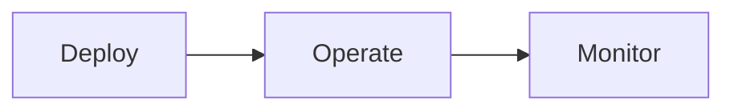

devops enables end to end SDLC
include finops in the process

## SDLC for Devops

> **Plan**:
> "the developers or software engineering team is your customer as a DevOps engineer so this is your opportunity to work with your customer before they go down a bad path."

> Code > Build > Testing > Release > Deploy

> **Operate**:
> "another operational thing that you do is include like a feedback loop from production back to your ops team letting you know about key events that happened in production such as a deployment back one step on the deployment thing this may or may not get automated depending on your environment the goal is to always automate it when possible"

> **Monitor**:
> "Reliability is a key factor here as well, at the end of the day we want our Application to be available all the time it is required. This then leads to other **observability, security and data management** areas that should be continuously monitored and feedback can always be used to better enhance, update and release the application continuously."

"FinOps: part of this continuous process we should also have the FinOps teams involved. Apps & Data are running and stored somewhere you should be monitoring this continuously to make sure if things change from a resources point of view your costs are not causing some major financial pain on your Cloud Bills."

## Target Areas of DevOps

DevOps focuses on software development as well but its values and tools also cover deployment and post-release stages like monitoring, high availability, security and data protection.

To adopt agile and DevOps simultaneously just follow 7 steps:

1. Unite the development and operation teams.
2. Create build and run teams, all development and operational concerns are discussed by the entire DevOps team.
3. Change your approach to sprints, and assign priority ratings to offer DevOps tasks that have the same value as development tasks. Encourage development and operations teams to exchange their opinion on other teams' workflow and possible issues.
4. Include QA in all development stages.
5. Choose the right tools.
6. Automate everything you can.
7. Measure and control by using tangible numeric deliverables.

## Continuous Delivery

## Continuous Integration

## Continuous Deployment

## DevOps stories

"DevOps if done correctly should help improve your business's speed and quality of software development. It should also help you to reduce costs and improve your overall business agility."

"A learning culture is a key part of DevOps. Even failure can be a success if lessons are learned. DevOps is about continuous improvement and learning from mistakes. It is about being open to change and being willing to try new things. It is about being willing to fail and learning from those failures."

[DevOps Stories](../days/day06.md)
